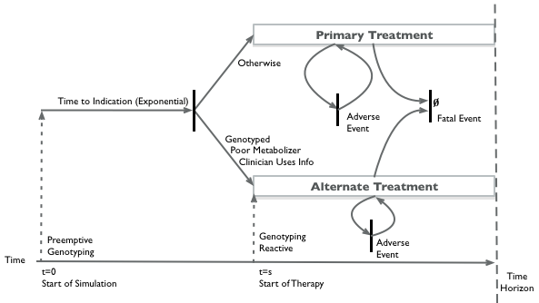
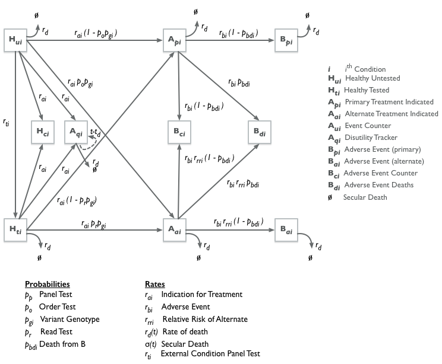

```{r ,include=FALSE}
# CONFIG
user_name <- "graveja0" 
project_name <- "PGx-DES" 
package_date <- "2017-09-01" 
```

## Notes
This report was generated on `r Sys.time()`.  The code for this project can be downloaded from [https://github.com/`r user_name`/`r project_name`](https://github.com/`r user_name`/`r project_name`). 

```{r, message=FALSE, warning=FALSE, include=FALSE}
detach_all_packages <- function() {
  basic_packages_blank <-  c("stats",
                             "graphics",
                             "grDevices",
                             "utils",
                             "datasets",
                             "methods",
                             "base")
  basic_packages <- paste("package:", basic_packages_blank, sep = "")

  package_list <- search()[
    ifelse(unlist(gregexpr("package:", search())) == 1, TRUE, FALSE)]

  package_list <- setdiff(package_list, basic_packages)

  if (length(package_list) > 0)  for (package in package_list) {
    detach(package, character.only = TRUE, unload = TRUE)
    print(paste("package ", package, " detached", sep = ""))
  }
}

detach_all_packages()

# this allows multiple persons to use the same RMarkdown
# without adjusting the working directory by themselves all the time
source("scripts/csf.R")
path_to_wd <- csf() # if this - for some reason - does not work, 
# replace with a hardcoded path, like so: "~/projects/rddj-template/analysis/"
if ( is.null(path_to_wd) | !dir.exists(path_to_wd)) {
  print("WARNING: No working directory specified for current user")
} else {
  setwd(path_to_wd)
}

cat("
library(ggplot2) # ggplot2, dplyr, tidyr, readr, purrr, tibble
library(purrr)
library(dplyr)
library(simmer)
library(rmarkdown)
library(ellipse)
library(readxl)
library(lhs)
library(ggthemes)
library(ggrepel)
library(mstate)
library(flexsurv)
library(lhs)
library(deSolve)", # Discrete Event Simulation 
file = "manifest.R")

# if checkpoint is not yet installed, install it (for people using this
# system for the first time)
if (!require(checkpoint)) {
  if (!require(devtools)) {
    install.packages("devtools", repos = "http://cran.us.r-project.org")
    require(devtools)
  }
  devtools::install_github("checkpoint",
                           username = "RevolutionAnalytics",
                           ref = "v0.3.2", # could be adapted later,
                           # as of now (beginning of July 2017
                           # this is the current release on CRAN)
                           repos = "http://cran.us.r-project.org")
  require(checkpoint)
}
# nolint start
if (!dir.exists("~/.checkpoint")) {
  dir.create("~/.checkpoint")
}
# nolint end
# install packages for the specified CRAN snapshot date
checkpoint(snapshotDate = package_date,
           project = path_to_wd,
           verbose = T,
           scanForPackages = T,
           use.knitr = F)
rm(package_date)

source("manifest.R")
unlink("manifest.R")
sessionInfo()
```

# Discrete Event Simulation

## Model Structure


## Model Inputs and Functions
```{r}
source("./scripts/model-functions.R")

#- Initial parameters for DES model run.
inputs.init <- list(
    vHorizon = 80,           # Number of Simulated Patients
    vN = 100,                # Age of Simulated Patients
    vAge= 40,                # Time Horizon (note: mortality tables end at age 110)
    vN_PSA = 1 ,             # Time Horizon (note: mortality tables end at age 110)
    vGender = 1,              # Gender 1=Female
    vPreemptive = "Panel",
    vReactive = "None"
  )

#- Define the parameter input file
scenario.file = "./input/cpic-model-parameters.xlsx"
base.ws <- "fixed"
debug.ws <- "debug" # For debugging purposes
vogi.ws <- "vogi"
psa.ws <- "psa"

temp <- 
  draw.parameter.values(scenario.file = scenario.file,
                        ws = base.ws,
                        PSA.N = inputs.init$vN_PSA)

drawn.parameter.values <- temp[["parameter.draws"]]
scenarios <- temp[["scenarios"]]

scenario.ids <- paste0("SC_",names(scenarios))
source("./scripts/des-simulation-main.R")
source("./scripts/costs_simple.R")
```

## Run DES for a Single Scenario
```{r}
# Reactive Single Genotyping Strategy
inputs.init$vReactive = "Single"
inputs.init$vPreemptive = "None"
source("./scripts/set-inputs.R")

# Run Model
#none.single <- suppressWarnings(exec.simulation(inputs)) %>% tbl_df() %>% 
#  mutate(preemptive = inputs.init$vPreemptive,
#  reactive = inputs.init$vReactive)
```

# Delay Differential Equation (DEDE)


```{r, message=FALSE, warning=FALSE, include=FALSE}
ss_death <- read.csv("./input/mortality-tables-2011.csv")
source("./scripts/dede-model.R")
source("./scripts/metamodeling-functions.R")
times    <- seq(0, inputs.init$vHorizon, by = 2 / 365) 
```

```{r,include=FALSE,message=FALSE,warning=FALSE}
single_gene_dede <-
  function(ss = "DL_AH_SL",
           scenario.file,
           ws,
           vogi = FALSE)
  {
    # Draw Parameter Values
    pp <-  
      draw.parameter.values(scenario.file = scenario.file,ws = ws,PSA.N = 1)
    scenario <-
      paste0("SC_", names(pp$scenarios)[which(pp$scenarios == ss)])
    scenario.num <- which(pp$scenarios == ss)
    
    other.scenarios <- paste0("SC_", names(pp$scenarios))
    other.scenarios <-
      other.scenarios[-which(other.scenarios == scenario)]
    
    config  <- pp$parameter.draws
    
    # Set Genetic Testing in Non-Selected Paramters to NONE
    # Note that this allows of competing risk of death from other scenarios
    # so that comparisons across single gene testing strategies are apples-to-apples.
    
    prob.order <- rep(0, length(pp$scenarios))
    if (vogi) prob.order[scenario.num] = 1 else
      prob.order[scenario.num] = config$risk[[paste0("vProbabilityOrder_",scenario)]]
    config$risk[grep("vProbabilityOrder", names(config$risk))]  <-
      prob.order
    config$risk[grep("vProbabilityRead", names(config$risk))]  <-
      prob.order
    
    # Run the DEDE Model For No PGx and for a Single Gene Test
    noPGx <-
      model.run(config, 1, "none", times) %>% t() %>% data.frame()
    
    singlePGx <-
      model.run(config, 1, "reactive-single", times) %>% t() %>% data.frame()
    
    out <- rbind(noPGx, singlePGx) %>%
      mutate(strategy = c("none", "reactive.single")) %>%
      select(strategy, dCOST, dQALY) %>% Get_ICER()
    return(out)
  }

# These are the names of the single scenarios
single.scenarios <-
  c("DL_AH_SL",
    "DL_AL_SH",
    "DH_AL_SL",
    "DH_AH_SL",
    "DL_AH_SH",
    "DH_AL_SH",
    "DH_AH_SH")
```

```{r vogi, cache=TRUE}
vogi.results <-
  single.scenarios %>% purrr::map_df( ~ single_gene_dede(.x,scenario.file=scenario.file,ws="fixed",vogi = TRUE), .id = "ID")
vogi.results$scenario = single.scenarios[as.numeric(vogi.results$ID)]

vogi.results %>% mutate(strategy = ifelse(strategy != "none", scenario, strategy)) %>%
  mutate(delta.QALY = dQALY-lead(dQALY),
         delta.COST = dCOST-lead(dCOST)) %>% 
  mutate(VOGI_50k = 50000*delta.QALY - delta.COST,
         VOGI_100k = 100000*delta.QALY - delta.COST)  %>% filter(strategy != "none") %>%
  select(strategy, VOGI_50k, VOGI_100k) %>% mutate_at(vars(contains("VOGI")), funs(prettyNum(
    round(., 0), big.mark = ",", scientific = FALSE
  ))) %>%
  tidyr::separate(strategy,
                  c("Drug_Freq", "Adverse_Event_Freq", "Adverse_Event_Severity")) %>%
  mutate(
    Drug_Freq = ifelse(Drug_Freq == "DH", "High", "Low"),
    Adverse_Event_Freq = ifelse(Adverse_Event_Freq == "AH", "High", "Low"),
    Adverse_Event_Severity = ifelse(Adverse_Event_Severity == "SH", "High", "Low")
  ) %>%
  knitr::kable(
    col.names = c(
      "Drug Frequency",
      "Adverse Event Frequency",
      "Adverse Event Severity",
      "VOGI (lambda = $50k/QALY)",
      "VOGI (lambda = $100k/QALY)"
    ),
    caption = "Value of Genetic Information"
  )

```


